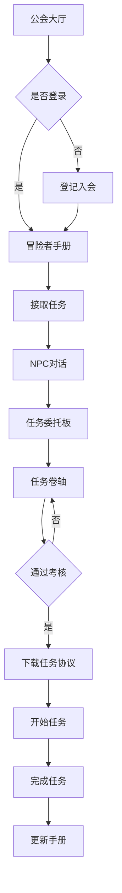

## 1. 产品概述
ONESMALLPR 冒险家工会是一个以RPG游戏风格呈现的开源任务平台。将传统的开源贡献转化为充满冒险精神的任务系统，让开发者在剑与魔法的世界中体验成为冒险者、接受委托、完成挑战的乐趣。

产品主要解决开源项目贡献门槛高、缺乏趣味性等问题，通过游戏化的方式降低参与门槛，激励更多开发者参与开源贡献。目标用户是所有对开源项目感兴趣的开发者，无论新手还是资深开发者都能在这里找到适合自己的冒险任务。

## 2. 核心功能

### 2.1 用户角色
| 角色 | 注册方式 | 核心权限 |
|------|----------|----------|
| 访客 | 无需注册 | 浏览任务板、查看任务详情、注册入会 |
| 冒险者 | 登记入会（用户名、技能、环境、兴趣） | 接受任务、查看个人手册、获得勋章、下载任务卷轴 |

### 2.2 功能模块
我们的冒险家工会包含以下核心页面：
1. **公会大厅**：英雄区域展示工会名称，提供加入公会和开始冒险的入口
2. **冒险者手册**：展示角色能力、历史任务记录和勋章成就
3. **任务委托板**：以悬赏令形式展示可接取的任务列表
4. **任务卷轴**：详细的任务说明、背景故事和接受流程

### 2.3 页面详情
| 页面名称 | 模块名称 | 功能描述 |
|----------|----------|----------|
| 公会大厅 | 英雄区域 | 显示"ONESMALLPR冒险家工会"标题，右上角提供【加入公会】按钮，中央显示【开始开源冒险】按钮 |
| 公会大厅 | 公会柜台 | 左侧显示剑与魔法世界背景图（工会内部场景），右侧显示冒险者手册，提供任务接取入口 |
| 冒险者手册 | 登记入会 | 未登录用户显示注册表单，收集用户名、本地环境、常用语言、兴趣方向、能力水平 |
| 冒险者手册 | 能力展示 | 以原神命座形式展示角色技能树，显示当前技能等级和解锁状态 |
| 冒险者手册 | 任务记录 | 展示历史接取的任务列表，包含任务状态【已完成】【已取消】【进行中】 |
| 冒险者手册 | 勋章成就 | 展示可解锁的成就徽章：第一个任务、Python初学者、Python中阶等 |
| 任务委托板 | 悬赏令展示 | 以木质公告板形式展示任务卡片，每个任务呈现为悬赏令风格 |
| 任务委托板 | 等级筛选 | 按冒险等级筛选：E级/D级/C级/B级 |
| 任务委托板 | 元素筛选 | 按编程语言筛选：Python/JavaScript/JSON/Documentation |
| 任务委托板 | 任务卡片 | 显示任务标题（RPG风格命名）、等级戳印、经验值奖励、贡献点奖励、接取状态 |
| 任务卷轴 | 背景故事 | 左侧展示AI生成的任务背景说明，包含项目宏观意义 |
| 任务卷轴 | 冒险考核 | 中间显示3道理解力检测题，用户答对后才能接取任务 |
| 任务卷轴 | 任务卷轴 | 右侧提供【领取任务卷轴】按钮，下载ONESMALLPR_TASK_PROTOCOL.md文件 |

## 3. 核心流程

### 访客流程
1. 访问公会大厅，浏览英雄区域
2. 滚动页面查看公会柜台和冒险者手册
3. 点击【登记入会】填写注册信息
4. 成为冒险者后查看个人手册
5. 点击【接取任务】触发NPC对话
6. 浏览任务委托板选择合适任务
7. 查看任务卷轴详情并完成考核
8. 下载任务协议开始冒险

### 冒险者流程
1. 登录后直接查看个人冒险者手册
2. 浏览能力树、任务记录和勋章
3. 前往任务委托板筛选任务
4. 根据等级和元素属性选择任务
5. 查看任务卷轴完成考核
6. 接取任务获得协议文件
7. 完成任务后获得经验和贡献点

## 4. 用户界面设计

### 4.1 设计风格
- **主色调**：深棕色（木质纹理）+ 古铜色（金属质感）+ 羊皮纸色（背景）
- **按钮样式**：3D浮雕效果，带有金属边框和阴影
- **字体**：中世纪风格字体，标题使用装饰性字体，正文使用易读衬线字体
- **布局风格**：卡片式布局，模拟真实卷轴和公告板
- **图标风格**：手绘风格的游戏图标，包含剑、盾牌、星星、月亮等RPG元素

### 4.2 页面设计概述
| 页面名称 | 模块名称 | UI元素 |
|----------|----------|--------|
| 公会大厅 | 英雄区域 | 深棕色木质背景，古铜色标题文字，3D按钮带有金属光泽，右上角登录按钮采用盾牌造型 |
| 公会大厅 | 公会柜台 | 左侧展示剑与魔法世界背景图，色调偏暖，右侧冒险者手册采用翻书动画效果 |
| 冒险者手册 | 能力展示 | 原神风格命座系统，圆形节点连接成星座图案，未解锁显示为灰色，已解锁显示为金色 |
| 冒险者手册 | 任务记录 | 羊皮纸卷轴样式，每项任务显示为独立的纸条，带有完成状态的印章 |
| 冒险者手册 | 勋章成就 | 徽章采用金属质感，未解锁为灰色轮廓，已解锁为彩色浮雕 |
| 任务委托板 | 悬赏令展示 | 木质纹理背景，任务卡片为悬赏令风格，带有撕裂边缘效果 |
| 任务委托板 | 任务卡片 | 左上角显示等级戳印（E/D/C/B），标题使用中世纪字体，奖励显示为金币和经验图标 |
| 任务卷轴 | 背景故事 | 左侧卷轴展开动画，文字呈现为手写风格，配有装饰性边框 |
| 任务卷轴 | 冒险考核 | 中间显示问答卡片，采用羊皮纸质感，答对后显示绿色勾，答错显示红色叉 |
| 任务卷轴 | 任务协议 | 右侧卷轴卷起动画，文件名显示为古英语字体，下载时伴有魔法光效 |

### 4.3 响应式设计
采用桌面优先设计策略，确保在大屏幕上能够完整展现RPG世界的细节和质感。移动端适配时保持核心游戏元素，简化装饰性内容，确保触摸交互的便利性。

### 4.4 3D场景指导
- **环境**：中世纪工会大厅，暖色调照明，木质结构和石墙纹理
- **光照**：主要光源来自壁炉和窗户，营造温馨冒险氛围
- **相机**：固定视角模拟玩家站在柜台前的第一人称视角
- **交互**：鼠标悬停时元素发光，点击时有魔法粒子效果
- **动画**：页面切换采用翻书效果，任务接取时显示传送门动画