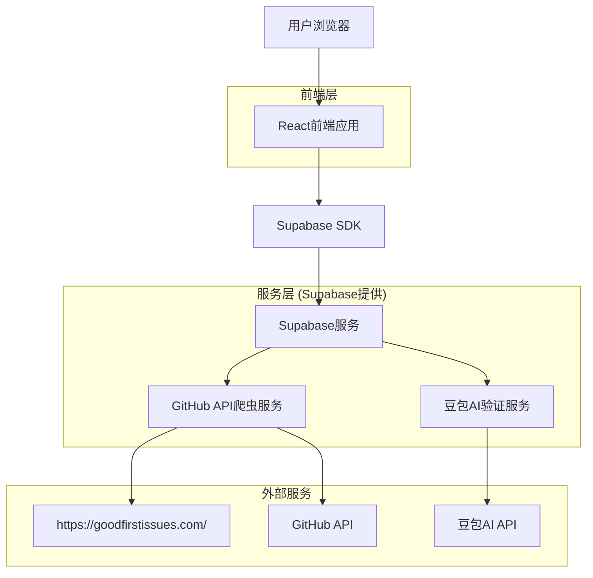
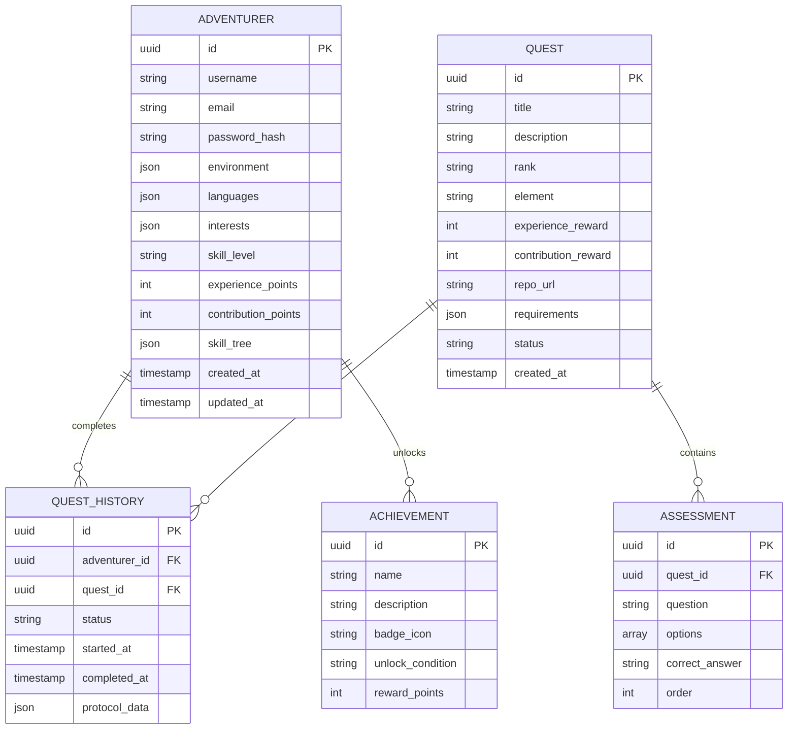

## 1. 架构设计



## 2. 技术描述

- **前端**: React@18 + tailwindcss@3 + vite
- **初始化工具**: vite-init
- **后端**: Supabase (提供认证、数据库、存储服务)
- **AI服务**: 豆包AI API (用于任务验证和技能评估)
- **外部API**: GitHub API (用于获取开源项目issues)
- **3D效果**: three.js + @react-three/fiber (用于RPG场景渲染)

## 3. 路由定义

| 路由 | 用途 |
|-------|---------|
| / | 公会大厅，展示英雄区域和公会柜台 |
| /handbook | 冒险者手册，展示角色信息和成就 |
| /quest-board | 任务委托板，展示可接取的任务列表 |
| /quest-scroll/:id | 任务卷轴，显示任务详情和接取流程 |
| /login | 加入公会，用户注册和登录页面 |

## 4. API定义

### 4.1 核心API

**用户认证相关**
```
POST /api/auth/register
```

请求:
| 参数名 | 参数类型 | 是否必需 | 描述 |
|-----------|-------------|-------------|-------------|
| username | string | 是 | 冒险者名称 |
| email | string | 是 | 邮箱地址 |
| password | string | 是 | 密码 |
| environment | string | 是 | 本地开发环境 |
| languages | array | 是 | 常用编程语言 |
| interests | array | 是 | 感兴趣的方向 |
| skill_level | string | 是 | 能力水平 |

响应:
| 参数名 | 参数类型 | 描述 |
|-----------|-------------|-------------|
| success | boolean | 注册状态 |
| user_id | string | 用户ID |

**任务相关**
```
GET /api/quests
```

请求参数:
| 参数名 | 参数类型 | 是否必需 | 描述 |
|-----------|-------------|-------------|-------------|
| rank | string | 否 | 任务等级 (E/D/C/B) |
| element | string | 否 | 元素属性 (Python/JavaScript等) |
| status | string | 否 | 任务状态 |

响应:
| 参数名 | 参数类型 | 描述 |
|-----------|-------------|-------------|
| quests | array | 任务列表 |

**接取任务 (试炼评估)**
```
POST /api/quests/:id/accept
```

请求:
| 参数名 | 参数类型 | 是否必需 | 描述 |
|-----------|-------------|-------------|-------------|
| answers | array | 是 | 试炼答案 |

响应:
| 参数名 | 参数类型 | 描述 |
|-----------|-------------|-------------|
| success | boolean | 接取状态 |
| score | number | 试炼得分 |
| protocol_url | string | 协议文件下载链接 |

**任务抓取与验证**
```
POST /api/admin/fetch-quests
```

描述: 每小时自动执行，从goodfirstissues.com抓取任务并用豆包AI验证

**技能评估生成**
```
POST /api/quests/:id/generate-assessment
```

描述: 为特定任务生成3个技能评估问题，基于仓库和issue内容

## 5. 数据模型

### 5.1 数据模型定义



## 6. 后端核心逻辑

### 6.1 任务抓取与验证流程

**抓取策略**:
1. 每小时定时从 `https://goodfirstissues.com/` 抓取最新的Good First Issue
2. 同时调用GitHub API获取issue的详细信息
3. 使用豆包AI API验证issue是否符合"Good First Issue"标准

**AI验证逻辑**:
```
调用豆包AI API (ARK_API_KEY)
提示词: "请判断以下GitHub issue是否真正适合初学者，是否描述清晰、难度适中：{issue内容}"
返回: 验证结果 (true/false) + 简要说明
```

**缓存策略**:
- 验证通过的任务存入Supabase quest表
- 设置状态为"available"
- 1小时后重新抓取验证

### 6.2 试炼评估机制

**触发时机**: 用户点击"接受任务"按钮时

**评估流程**:
1. 调用豆包AI API生成3个针对性问题
2. 基于仓库技术栈和issue具体内容
3. 用户必须回答所有问题才能接取任务

**AI生成问题示例**:
```
调用豆包AI API (ARK_API_KEY)
提示词: "基于这个GitHub仓库{repo_url}和这个issue{issue内容}，生成3个技术问题来评估用户是否具备解决此问题的能力"
返回: 3个问题 + 标准答案
```

**评分标准**:
- 每题33.3分，总分100分
- 60分以上允许接取任务
- 低于60分提示"技能不匹配"

**冒险者表 (adventurers)**
```sql
-- 创建表
CREATE TABLE adventurers (
    id UUID PRIMARY KEY DEFAULT gen_random_uuid(),
    username VARCHAR(100) UNIQUE NOT NULL,
    email VARCHAR(255) UNIQUE NOT NULL,
    password_hash VARCHAR(255) NOT NULL,
    environment JSONB DEFAULT '{}',
    languages JSONB DEFAULT '[]',
    interests JSONB DEFAULT '[]',
    skill_level VARCHAR(20) DEFAULT 'novice' CHECK (skill_level IN ('novice', 'intermediate', 'advanced', 'expert')),
    experience_points INTEGER DEFAULT 0,
    contribution_points INTEGER DEFAULT 0,
    skill_tree JSONB DEFAULT '{}',
    created_at TIMESTAMP WITH TIME ZONE DEFAULT NOW(),
    updated_at TIMESTAMP WITH TIME ZONE DEFAULT NOW()
);

-- 创建索引
CREATE INDEX idx_adventurers_username ON adventurers(username);
CREATE INDEX idx_adventurers_email ON adventurers(email);
```

**任务表 (quests)**
```sql
-- 创建表
CREATE TABLE quests (
    id UUID PRIMARY KEY DEFAULT gen_random_uuid(),
    title VARCHAR(200) NOT NULL,
    description TEXT NOT NULL,
    rank VARCHAR(10) NOT NULL CHECK (rank IN ('E', 'D', 'C', 'B', 'A', 'S')),
    element VARCHAR(50) NOT NULL,
    experience_reward INTEGER DEFAULT 0,
    contribution_reward INTEGER DEFAULT 0,
    repo_url VARCHAR(500),
    requirements JSONB DEFAULT '{}',
    status VARCHAR(20) DEFAULT 'available' CHECK (status IN ('available', 'claimed', 'completed')),
    created_at TIMESTAMP WITH TIME ZONE DEFAULT NOW()
);

-- 创建索引
CREATE INDEX idx_quests_rank ON quests(rank);
CREATE INDEX idx_quests_element ON quests(element);
CREATE INDEX idx_quests_status ON quests(status);
```

**任务历史表 (quest_history)**
```sql
-- 创建表
CREATE TABLE quest_history (
    id UUID PRIMARY KEY DEFAULT gen_random_uuid(),
    adventurer_id UUID REFERENCES adventurers(id) ON DELETE CASCADE,
    quest_id UUID REFERENCES quests(id) ON DELETE CASCADE,
    status VARCHAR(20) DEFAULT 'in_progress' CHECK (status IN ('in_progress', 'completed', 'cancelled')),
    started_at TIMESTAMP WITH TIME ZONE DEFAULT NOW(),
    completed_at TIMESTAMP WITH TIME ZONE,
    protocol_data JSONB DEFAULT '{}',
    created_at TIMESTAMP WITH TIME ZONE DEFAULT NOW()
);

-- 创建索引
CREATE INDEX idx_quest_history_adventurer_id ON quest_history(adventurer_id);
CREATE INDEX idx_quest_history_quest_id ON quest_history(quest_id);
CREATE INDEX idx_quest_history_status ON quest_history(status);
```

**成就表 (achievements)**
```sql
-- 创建表
CREATE TABLE achievements (
    id UUID PRIMARY KEY DEFAULT gen_random_uuid(),
    name VARCHAR(100) NOT NULL,
    description TEXT NOT NULL,
    badge_icon VARCHAR(200),
    unlock_condition VARCHAR(200),
    reward_points INTEGER DEFAULT 0,
    created_at TIMESTAMP WITH TIME ZONE DEFAULT NOW()
);

-- 初始数据
INSERT INTO achievements (name, description, badge_icon, unlock_condition, reward_points) VALUES
('first_quest', '完成第一个任务', '🌟', 'complete_first_quest', 100),
('python_novice', 'Python初学者', '🐍', 'complete_python_quests_5', 200),
('python_intermediate', 'Python中阶', '🐍⚡', 'complete_python_quests_20', 500),
('javascript_master', 'JavaScript大师', '⚔️', 'complete_javascript_quests_30', 800),
('documentation_hero', '文档英雄', '📜', 'complete_doc_quests_15', 400);
```

### 6.3 权限设置
```sql
-- 匿名用户权限
GRANT SELECT ON quests TO anon;
GRANT SELECT ON achievements TO anon;

-- 认证用户权限
GRANT ALL PRIVILEGES ON adventurers TO authenticated;
GRANT ALL PRIVILEGES ON quest_history TO authenticated;
GRANT SELECT ON quests TO authenticated;
GRANT SELECT ON achievements TO authenticated;
```