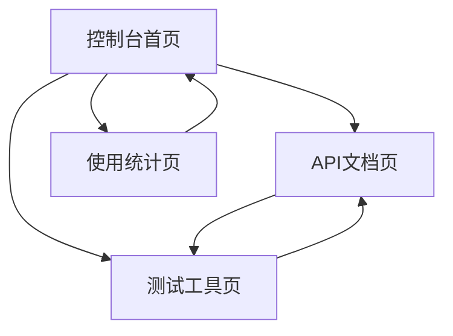

## 1. 产品概述
豆包API集成项目是一个帮助开发者快速集成和使用豆包AI能力的开发工具平台。通过提供标准化的API接口和SDK，开发者可以轻松调用豆包的图像识别、文本生成等AI功能，加速应用开发进程。

## 2. 核心功能

### 2.1 用户角色
| 角色 | 注册方式 | 核心权限 |
|------|----------|----------|
| 开发者 | 邮箱注册 | 创建API密钥、调用API、查看使用统计 |
| 企业用户 | 企业认证 | 高级API权限、批量调用、技术支持 |

### 2.2 功能模块
项目包含以下核心页面：
1. **控制台首页**：API密钥管理、快速开始指南、使用统计概览
2. **API文档页**：接口说明、代码示例、错误码说明
3. **测试工具页**：在线API测试、请求构造器、响应预览
4. **使用统计页**：调用次数统计、费用明细、性能监控

### 2.3 页面详情
| 页面名称 | 模块名称 | 功能描述 |
|----------|----------|----------|
| 控制台首页 | API密钥管理 | 生成、查看、删除API密钥，支持密钥权限设置 |
| 控制台首页 | 快速开始 | 提供curl、Python、JavaScript等语言的示例代码 |
| 控制台首页 | 使用概览 | 显示今日调用次数、本月费用、API状态等关键指标 |
| API文档页 | 接口列表 | 展示所有可用API端点、请求参数、响应格式 |
| API文档页 | 代码示例 | 提供多种编程语言的完整调用示例 |
| API文档页 | 错误处理 | 列出常见错误码及解决方案 |
| 测试工具页 | 请求构造器 | 可视化表单构建API请求，支持参数验证 |
| 测试工具页 | 响应预览 | 实时显示API响应，支持JSON格式化和高亮 |
| 测试工具页 | 历史记录 | 保存测试记录，支持重新执行和分享 |
| 使用统计页 | 调用统计 | 按时间维度展示API调用趋势图表 |
| 使用统计页 | 费用明细 | 详细列出每次调用的费用和总计 |
| 使用统计页 | 性能监控 | 显示API响应时间、成功率等性能指标 |

## 3. 核心流程

### 开发者使用流程
1. 用户注册并登录系统
2. 在控制台创建API密钥
3. 查看API文档了解接口详情
4. 使用测试工具验证API调用
5. 集成API到自有应用中
6. 通过使用统计监控调用情况

### 页面导航流程

## 4. 用户界面设计

### 4.1 设计风格
- **主色调**：深蓝色(#1e40af)作为主色，白色(#ffffff)作为背景
- **按钮样式**：圆角矩形设计，主要操作为实心按钮，次要操作为边框按钮
- **字体选择**：系统字体栈，主要文字14-16px，标题18-24px
- **布局风格**：左侧导航+右侧内容区的经典管理后台布局
- **图标风格**：使用简洁的线性图标，保持视觉一致性

### 4.2 页面设计概览
| 页面名称 | 模块名称 | UI元素 |
|----------|----------|--------|
| 控制台首页 | API密钥管理 | 卡片式布局展示密钥列表，包含复制按钮、状态标签、创建时间 |
| 控制台首页 | 使用概览 | 四宫格仪表板，使用大号数字和趋势箭头显示关键指标 |
| API文档页 | 接口列表 | 左侧树形导航，右侧详细文档，支持锚点跳转 |
| 测试工具页 | 请求构造器 | 分栏布局，左侧表单区域，右侧代码预览区域 |
| 使用统计页 | 调用统计 | 时间选择器+折线图，支持日/周/月视图切换 |

### 4.3 响应式设计
采用桌面端优先的设计策略，确保在1920x1080分辨率下有最佳体验。同时适配1366x768和2560x1440等常见分辨率。移动端采用自适应布局，关键功能在平板和手机上均可正常使用。

### 4.4 交互优化
- 所有API调用操作都有加载状态提示
- 错误信息使用友好的弹窗提示，避免使用alert
- 支持键盘快捷键，如Ctrl+S保存测试请求
- 提供深色模式切换，保护开发者视力