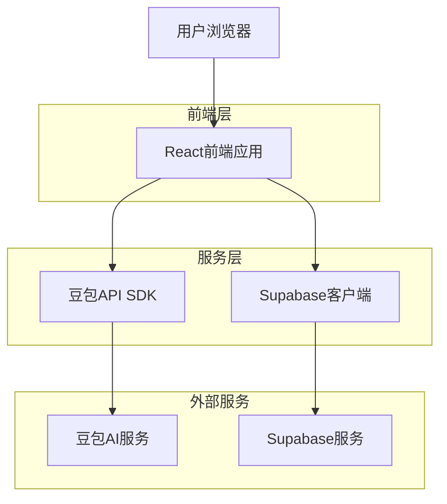
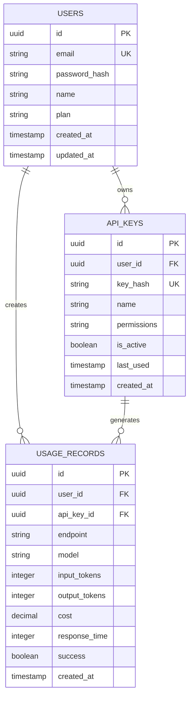

## 1. 架构设计



## 2. 技术描述
- 前端：React@18 + TypeScript + Tailwind CSS + Vite
- 初始化工具：vite-init
- 后端：无（直接使用豆包API和Supabase）
- 状态管理：React Context + useReducer
- API客户端：OpenAI SDK（兼容豆包API格式）
- 认证：Supabase Auth
- 数据库：Supabase PostgreSQL（用于用户数据和API使用记录）

## 3. 路由定义
| 路由 | 用途 |
|------|------|
| / | 控制台首页，API密钥管理和使用概览 |
| /docs | API文档页面，展示接口说明和示例 |
| /test | API测试工具页面，支持在线调试 |
| /stats | 使用统计页面，显示调用记录和费用 |
| /login | 用户登录页面 |
| /register | 用户注册页面 |
| /settings | 用户设置页面，管理个人信息 |

## 4. API定义

### 4.1 豆包API集成
```typescript
// API配置类型
interface DoubaoConfig {
  apiKey: string;
  baseURL: string;
  model: string;
}

// 请求类型
interface DoubaoRequest {
  model: string;
  input: Array<{
    role: 'user' | 'system' | 'assistant';
    content: Array<{
      type: 'input_text' | 'input_image';
      text?: string;
      image_url?: string;
    }>;
  }>;
}

// 响应类型
interface DoubaoResponse {
  id: string;
  model: string;
  output: {
    content: Array<{
      type: 'text';
      text: string;
    }>;
  };
  usage: {
    input_tokens: number;
    output_tokens: number;
  };
}
```

### 4.2 内部API端点
```
POST /api/auth/login
POST /api/auth/register
GET  /api/user/profile
POST /api/keys/generate
GET  /api/keys/list
DELETE /api/keys/:id
POST /api/usage/record
GET  /api/usage/stats
```

## 5. 数据模型

### 5.1 数据模型定义


### 5.2 数据定义语言
```sql
-- 用户表
CREATE TABLE users (
  id UUID PRIMARY KEY DEFAULT gen_random_uuid(),
  email VARCHAR(255) UNIQUE NOT NULL,
  password_hash VARCHAR(255) NOT NULL,
  name VARCHAR(100) NOT NULL,
  plan VARCHAR(20) DEFAULT 'free' CHECK (plan IN ('free', 'pro', 'enterprise')),
  created_at TIMESTAMP WITH TIME ZONE DEFAULT NOW(),
  updated_at TIMESTAMP WITH TIME ZONE DEFAULT NOW()
);

-- API密钥表
CREATE TABLE api_keys (
  id UUID PRIMARY KEY DEFAULT gen_random_uuid(),
  user_id UUID REFERENCES users(id) ON DELETE CASCADE,
  key_hash VARCHAR(255) UNIQUE NOT NULL,
  name VARCHAR(100) NOT NULL,
  permissions JSONB DEFAULT '[]',
  is_active BOOLEAN DEFAULT true,
  last_used TIMESTAMP WITH TIME ZONE,
  created_at TIMESTAMP WITH TIME ZONE DEFAULT NOW()
);

-- 使用记录表
CREATE TABLE usage_records (
  id UUID PRIMARY KEY DEFAULT gen_random_uuid(),
  user_id UUID REFERENCES users(id) ON DELETE CASCADE,
  api_key_id UUID REFERENCES api_keys(id) ON DELETE CASCADE,
  endpoint VARCHAR(100) NOT NULL,
  model VARCHAR(100) NOT NULL,
  input_tokens INTEGER DEFAULT 0,
  output_tokens INTEGER DEFAULT 0,
  cost DECIMAL(10,6) DEFAULT 0,
  response_time INTEGER,
  success BOOLEAN DEFAULT true,
  created_at TIMESTAMP WITH TIME ZONE DEFAULT NOW()
);

-- 创建索引
CREATE INDEX idx_api_keys_user_id ON api_keys(user_id);
CREATE INDEX idx_usage_records_user_id ON usage_records(user_id);
CREATE INDEX idx_usage_records_created_at ON usage_records(created_at DESC);
CREATE INDEX idx_usage_records_model ON usage_records(model);

-- Supabase RLS策略
ALTER TABLE api_keys ENABLE ROW LEVEL SECURITY;
ALTER TABLE usage_records ENABLE ROW LEVEL SECURITY;

-- 用户只能访问自己的API密钥
CREATE POLICY "Users can view own api_keys" ON api_keys
  FOR SELECT USING (auth.uid() = user_id);

-- 用户只能查看自己的使用记录
CREATE POLICY "Users can view own usage" ON usage_records
  FOR SELECT USING (auth.uid() = user_id);
```

## 6. 核心组件设计

### 6.1 API客户端封装
```typescript
// lib/doubao-client.ts
import OpenAI from 'openai';

export class DoubaoClient {
  private client: OpenAI;
  
  constructor(apiKey: string) {
    this.client = new OpenAI({
      apiKey,
      baseURL: 'https://ark.cn-beijing.volces.com/api/v3',
    });
  }

  async generateResponse(
    model: string,
    messages: DoubaoRequest['input']
  ): Promise<DoubaoResponse> {
    const response = await this.client.responses.create({
      model,
      input: messages,
    });
    
    return response as DoubaoResponse;
  }
}
```

### 6.2 认证上下文
```typescript
// contexts/AuthContext.tsx
interface AuthContextType {
  user: User | null;
  login: (email: string, password: string) => Promise<void>;
  logout: () => Promise<void>;
  loading: boolean;
}

export const AuthContext = createContext<AuthContextType>(...);
```

## 7. 部署配置
- 环境变量：VITE_SUPABASE_URL、VITE_SUPABASE_ANON_KEY
- 构建输出：dist目录
- 静态托管：支持Vercel、Netlify、GitHub Pages
- 自定义域名：支持通过CNAME配置