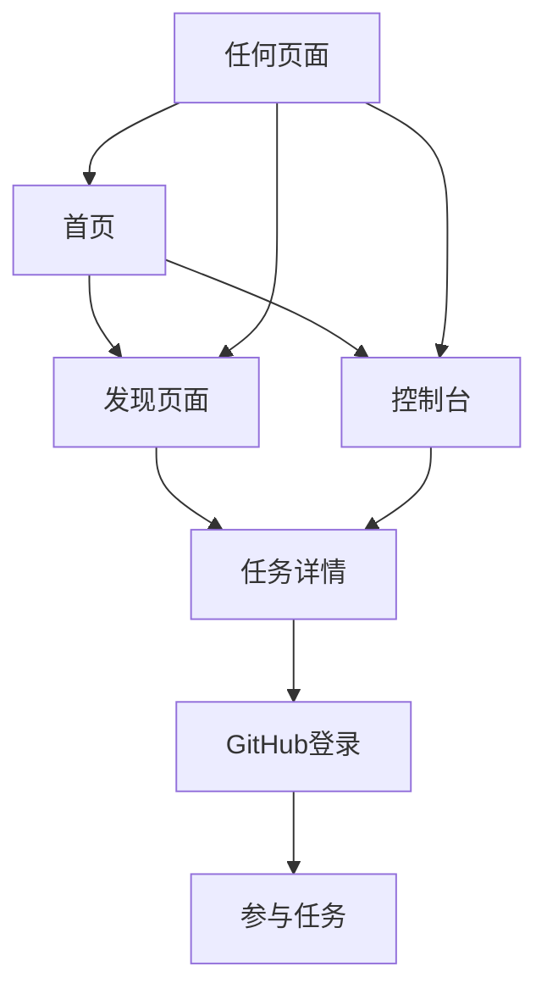

## 1. 产品概述
ONESMALLPR 是一个帮助AI初学者通过开源贡献建立技术影响力的平台。本次改进主要解决站内导航体验问题，让用户能够更便捷地在不同页面间切换，同时更新GitHub项目链接。

## 2. 核心功能

### 2.1 用户角色
| 角色 | 注册方式 | 核心权限 |
|------|----------|----------|
| 访客用户 | 无需注册 | 浏览首页、发现页面、查看任务详情 |
| 登录用户 | GitHub OAuth | 访问控制台、个人资料、参与任务、提交PR |

### 2.2 功能模块
导航改进需求包含以下核心页面：
1. **首页**：展示平台价值主张、工作流程、热门任务
2. **发现页面**：任务列表、任务筛选、任务详情
3. **控制台页面**：个人仪表板、任务进度、知识图谱
4. **个人资料页面**：用户信息、贡献历史、技能评估

### 2.3 页面详情
| 页面名称 | 模块名称 | 功能描述 |
|----------|----------|----------|
| 全局导航 | 主导航栏 | 显示Logo、Home链接、Discover链接、Console链接、用户登录状态 |
| 全局导航 | 用户菜单 | 登录用户显示用户名和退出按钮，未登录显示GitHub登录按钮 |
| 首页 | Hero区域 | 展示平台标语、开始旅程按钮、GitHub链接按钮 |
| 首页 | 工作流程 | 展示4步工作流程：入门、发现、共创、进化 |
| 首页 | 热门任务 | 显示3个热门任务卡片，提供"查看全部"链接 |
| 发现页面 | 任务列表 | 展示可参与的开源任务 |
| 控制台页面 | 仪表板 | 显示用户进度和统计信息 |
| 个人资料页面 | 用户信息 | 显示用户基本信息和贡献历史 |

## 3. 核心流程

### 用户导航流程
1. **访客流程**：首页 → 发现页面 → 任务详情 → 登录 → 参与任务
2. **登录用户流程**：首页 → 控制台/发现页面 → 任务详情 → 提交PR → 查看进度

## 4. 用户界面设计

### 4.1 设计样式
- **主色调**：深蓝色渐变（from-primary to-blue-900）
- **辅助色**：白色、灰色系（bg-gray-50、bg-gray-900）
- **按钮样式**：圆角矩形，包含主要按钮（secondary）和轮廓按钮（outline）
- **字体**：现代无衬线字体，标题使用font-heading
- **布局风格**：卡片式布局，响应式网格系统
- **图标风格**：使用lucide-react图标库，简洁线条风格

### 4.2 页面设计概述
| 页面名称 | 模块名称 | UI元素 |
|----------|----------|--------|
| 全局导航 | 导航栏 | 深蓝色背景，白色文字，固定顶部，包含Logo和导航链接 |
| 全局导航 | 用户区域 | 右侧对齐，显示用户头像或登录按钮 |
| 首页 | Hero区域 | 渐变背景，大标题，副标题，两个并排按钮 |
| 首页 | 工作流程 | 白色背景，4列网格布局，图标+标题+描述 |
| 首页 | 热门任务 | 浅灰色背景，3列卡片布局 |

### 4.3 响应式设计
- **桌面优先**：默认设计为桌面端，然后适配移动端
- **断点设置**：md（768px）和sm（640px）
- **移动端适配**：导航链接在小屏幕隐藏文字，只显示图标
- **触摸优化**：按钮和链接具有足够的点击区域

## 5. 技术改进要点

### 5.1 导航改进
- 在Navbar组件中添加显式的Home、Discover、Console导航链接
- 移除响应式隐藏，确保所有屏幕尺寸都能访问导航
- 添加用户下拉菜单，包含个人资料和退出选项
- 优化Logo链接，确保点击可返回首页

### 5.2 GitHub链接更新
- 更新所有GitHub链接为：`https://github.com/MIngjianZhang/onesmallpr`
- 确保外部链接使用`<a>`标签而非`Link`组件
- 添加`target="_blank"`和`rel="noreferrer"`属性

### 5.3 外部链接处理
- 修复Button组件，正确识别和处理外部URL
- 外部链接自动使用`<a>`标签，内部链接使用`Link`组件
- 确保GitHub按钮能够正常跳转