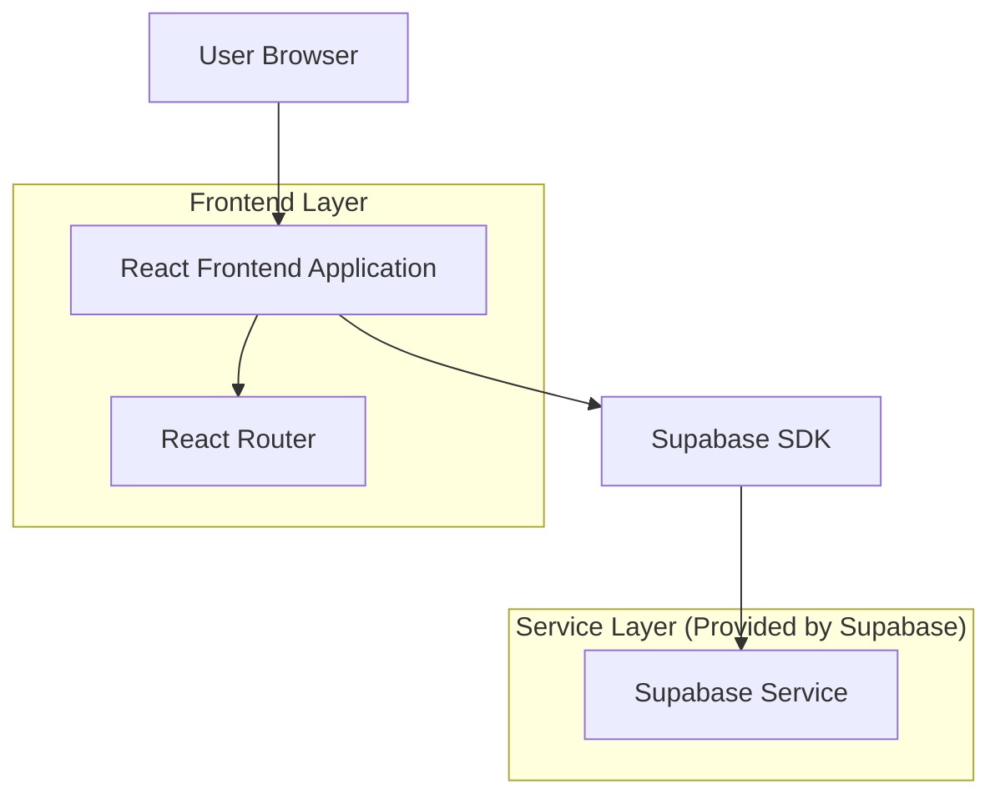
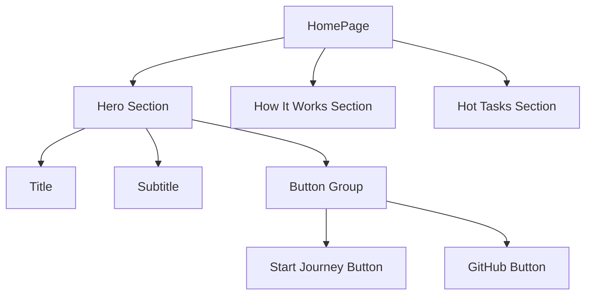
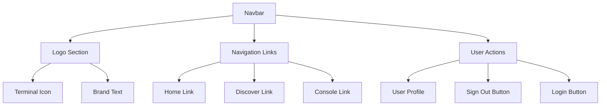

## 1. 架构设计



## 2. 技术描述

- **前端**: React@18 + tailwindcss@3 + vite
- **初始化工具**: vite-init
- **后端**: Supabase (认证 + 数据库)
- **路由管理**: React Router v6
- **UI组件**: lucide-react (图标)
- **认证**: Supabase Auth (GitHub OAuth)

## 3. 路由定义

| 路由 | 目的 |
|------|------|
| / | 首页，展示平台介绍和热门任务 |
| /discover | 发现页面，浏览和筛选开源任务 |
| /console | 控制台页面，用户个人仪表板 |
| /profile | 个人资料页面，用户信息管理 |
| /login | 登录页面，GitHub OAuth认证 |
| /task/:id | 任务详情页面，查看具体任务信息 |

## 4. 核心组件架构

### 4.1 布局组件
```typescript
// Navbar.tsx - 全局导航组件
interface NavbarProps {
  // 无props，使用useAuth获取用户状态
}

// Footer.tsx - 页脚组件
interface FooterProps {
  // 静态组件，无props
}
```

### 4.2 导航链接配置
```typescript
// 导航链接常量
const NAVIGATION_LINKS = [
  { path: '/', label: 'Home', icon: null },
  { path: '/discover', label: 'Discover', icon: null },
  { path: '/console', label: 'Console', icon: LayoutDashboard }
];
```

### 4.3 Button组件外部链接处理
```typescript
// Button.tsx - 支持外部链接的按钮组件
interface ButtonProps {
  href?: string;
  children: React.ReactNode;
  variant?: 'primary' | 'secondary' | 'outline';
  size?: 'sm' | 'md' | 'lg';
  className?: string;
}

// 外部链接检测逻辑
const isExternalLink = (href: string): boolean => {
  return href.startsWith('http') || href.startsWith('https');
};
```

## 5. 页面组件结构

### 5.1 首页组件 (HomePage.tsx)


### 5.2 导航栏组件 (Navbar.tsx)


## 6. 数据模型

### 6.1 用户认证模型
```typescript
// Supabase Auth User
interface User {
  id: string;
  email: string;
  user_metadata: {
    full_name?: string;
    avatar_url?: string;
  };
  created_at: string;
  updated_at: string;
}
```

### 6.2 任务数据模型
```typescript
interface Task {
  id: string;
  title: string;
  repo: string;
  tags: string[];
  difficulty: number; // 0-1 难度等级
  description: string;
  status?: 'open' | 'in-progress' | 'completed';
}
```

## 7. 外部链接配置

### 7.1 GitHub链接配置
```typescript
// 常量配置
const GITHUB_REPO_URL = 'https://github.com/MIngjianZhang/onesmallpr';
const GITHUB_ISSUES_URL = `${GITHUB_REPO_URL}/issues`;
```

### 7.2 链接安全处理
```typescript
// 外部链接安全属性
const externalLinkProps = {
  target: '_blank',
  rel: 'noreferrer noopener'
};
```

## 8. 响应式设计实现

### 8.1 断点配置
```typescript
// Tailwind CSS 断点
// sm: 640px
// md: 768px  
// lg: 1024px
// xl: 1280px
// 2xl: 1536px
```

### 8.2 导航响应式处理
```typescript
// 移动端隐藏文字，显示图标
<span className="hidden sm:inline">Console</span>
```

## 9. 性能优化

### 9.1 组件懒加载
```typescript
// 路由懒加载配置
const DiscoverPage = lazy(() => import('./pages/DiscoverPage'));
const ConsolePage = lazy(() => import('./pages/ConsolePage'));
```

### 9.2 图标优化
- 使用lucide-react的tree-shaking支持
- 按需导入图标组件
- 避免全量导入图标库