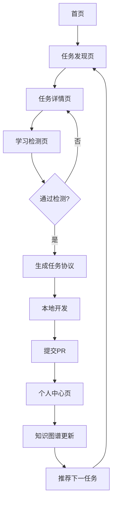

## 1. 产品概述

ONESMALLPR是一款面向AI初学者的开源贡献学习平台，通过引导用户完成真实的GitHub Good First Issue来构建个人技术话语体系与知识图谱。

产品核心理念是"让每一次贡献，都成为进化的台阶"，目标人群为零基础转行人员、在校学生、对AI感兴趣的非技术在职人员。

## 2. 核心功能

### 2.1 用户角色

| 角色 | 注册方式 | 核心权限 |
|------|----------|----------|
| 初学者用户 | GitHub OAuth注册 | 浏览任务、生成协议、提交PR、查看知识图谱 |
| 访客用户 | 无需注册 | 浏览任务、查看基础功能 |

### 2.2 功能模块

产品包含以下核心页面：

1. **首页**: 产品简介、快速开始入口、热门任务展示
2. **任务发现页**: 个性化任务推荐、任务筛选、难度评估
3. **任务详情页**: 任务分析、理解检测、协议生成
4. **个人中心页**: 知识图谱、成就展示、历史记录
5. **学习检测页**: AI问答测试、能力评估

### 2.3 页面详情

| 页面名称 | 模块名称 | 功能描述 |
|----------|----------|----------|
| 首页 | Hero区域 | 展示产品标语和核心理念，提供快速开始按钮 |
| 首页 | 功能特色 | 介绍产品四大阶段流程，展示用户成长路径 |
| 首页 | 热门任务 | 展示当前推荐的入门级开源任务 |
| 任务发现页 | 智能推荐 | 基于用户画像推荐难度为0-1的Good First Issue |
| 任务发现页 | 自定义输入 | 支持用户输入Repo链接或Issue链接 |
| 任务发现页 | 匹配度评估 | AI分析任务难度，提供劝退或准入建议 |
| 任务详情页 | 任务解析 | 展示Issue详情、项目背景、技术要求 |
| 任务详情页 | 理解检测 | 生成3道选择题/填空题测试用户理解程度 |
| 任务详情页 | 协议生成 | 生成结构化的ONESMALLPR_TASK_PROTOCOL.md文件 |
| 个人中心页 | 知识图谱 | 可视化展示用户技能成长网络图 |
| 个人中心页 | 成就系统 | 展示已完成的PR贡献和获得的徽章 |
| 个人中心页 | 推荐进阶 | 基于历史表现推荐下一阶段的挑战性任务 |
| 学习检测页 | AI问答 | 针对具体Issue生成理解测试题目 |
| 学习检测页 | 能力评估 | 根据答题情况评估用户是否准备好开始任务 |

## 3. 核心流程

### 用户主流程：
1. 用户通过GitHub OAuth注册登录
2. 完成技术画像评估和环境自检
3. 浏览推荐的Good First Issue任务
4. 选择任务后进行理解检测问答
5. 通过检测后生成任务协议文档
6. 本地完成任务后提交PR
7. PR成功后更新知识图谱和成就

## 4. 用户界面设计

### 4.1 设计风格
- **主色调**: 深蓝色 (#1E40AF) 代表技术深度，搭配亮黄色 (#F59E0B) 突出活力
- **按钮样式**: 圆角设计，主要操作为实心填充，次要操作为边框样式
- **字体**: 中文使用思源黑体，英文使用Inter，标题18-24px，正文14-16px
- **布局风格**: 卡片式布局，响应式网格系统，强调信息的层次性
- **图标风格**: 使用简洁的线条图标，配合emoji增强亲和力

### 4.2 页面设计

| 页面名称 | 模块名称 | UI元素 |
|----------|----------|----------|
| 首页 | Hero区域 | 深蓝色渐变背景，居中显示标语"让每一次贡献，都成为进化的台阶"，下方配CTA按钮 |
| 任务发现页 | 任务卡片 | 白色卡片包含项目logo、任务标题、难度标签、技术栈标签，悬停时有阴影效果 |
| 任务详情页 | 信息面板 | 左侧显示任务详情，右侧显示项目统计信息，顶部有进度指示器 |
| 学习检测页 | 问答界面 | 简洁的单选题界面，每题配有进度条，底部有上一题/下一题导航 |
| 个人中心页 | 知识图谱 | 使用D3.js绘制的交互式网络图，节点代表技能，边代表关联关系 |

### 4.3 响应式设计
- 采用桌面优先设计策略，确保在1920x1080分辨率下的最佳体验
- 平板端(768px-1024px)采用自适应布局，调整卡片排列方式
- 移动端(<768px)采用单列布局，优先展示核心功能
- 支持触摸交互优化，按钮最小点击区域为44x44px

## 5. 技术实现要求

### 5.1 性能指标
- 页面首次加载时间 < 3秒
- 任务推荐响应时间 < 1秒
- 支持同时在线用户 > 1000人

### 5.2 兼容性要求
- 支持Chrome、Firefox、Safari、Edge最新版本
- 支持ES6+语法，使用Babel进行转译
- 移动端支持iOS 12+和Android 8+

### 5.3 可访问性
- 支持键盘导航操作
- 提供屏幕阅读器支持
- 颜色对比度符合WCAG 2.1 AA标准