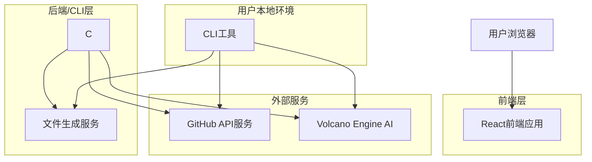
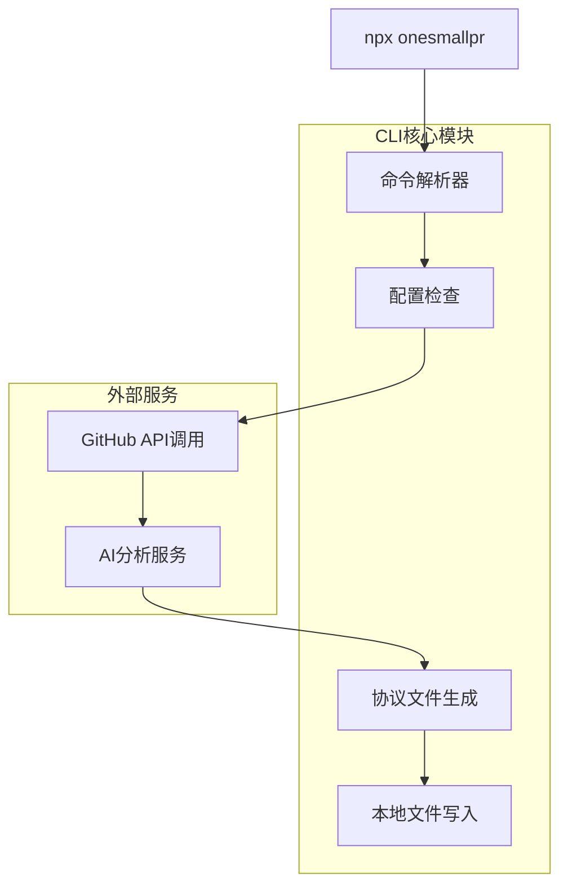

## 1. 架构设计



## 2. 技术描述

- **前端**: React@18 + Vite + Tailwind CSS
- **初始化工具**: vite-init
- **后端**: Node.js + Express@4 (API代理服务)
- **CLI工具**: Node.js + Commander.js (npx命令行工具)
- **AI服务**: Doubao AI Model (字节跳动豆包大模型)
- **数据存储**: 本地JSON文件 (MVP阶段)
- **版本控制**: GitHub API v4 (GraphQL)

## 3. 路由定义

| 路由 | 用途 |
|-------|---------|
| / | 首页，产品简介和快速入口 |
| /discover | 任务发现页，展示推荐的开源任务 |
| /task/:id | 任务详情页，显示具体Issue信息和分析 |
| /assessment/:id | 学习检测页，AI问答测试界面 |
| /protocol/:id | 协议生成页，生成和下载任务协议 |
| /profile | 个人中心页，展示用户知识图谱和成就 |
| /login | 登录页，模拟登录/注册系统 |

## 4. API定义

### 4.1 任务相关API

```
GET /api/tasks/fetch-from-github
```

请求参数：
| 参数名 | 参数类型 | 是否必需 | 描述 |
|--------|----------|----------|------|
| forceRefresh | boolean | false | 强制刷新缓存，默认false |
| cacheTimeout | number | false | 缓存超时时间(小时)，默认1小时 |

响应示例：
```json
{
  "tasks": [
    {
      "id": "issue-123",
      "title": "Fix typo in documentation",
      "repository": "facebook/react",
      "difficulty": 0,
      "realDifficulty": 1,
      "aiAnalysis": {
        "isTrulyEasy": true,
        "reason": "任务仅涉及文档修改，无需代码逻辑变更",
        "estimatedTime": "15-30分钟"
      },
      "labels": ["good first issue", "documentation"],
      "description": "There is a small typo in the README file...",
      "url": "https://github.com/facebook/react/issues/123",
      "fetchedAt": "2024-01-15T10:30:00Z",
      "cacheExpiry": "2024-01-15T11:30:00Z"
    }
  ],
  "total": 25,
  "cacheInfo": {
    "hit": true,
    "expiry": "2024-01-15T11:30:00Z"
  }
}
```

```
GET /api/tasks/:id/analyze
```

响应示例：
```json
{
  "id": "issue-123",
  "analysis": {
    "complexity": "low",
    "estimatedTime": "30分钟",
    "requiredSkills": ["Markdown", "Git基础"],
    "projectBackground": "React是Facebook开发的前端框架...",
    "technicalRequirements": "需要熟悉基本的文档编辑"
  }
}
```

### 4.2 学习检测API

```
POST /api/assessment/generate
```

请求体：
```json
{
  "issueId": "issue-123",
  "taskDescription": "Fix typo in documentation"
}
```

响应示例：
```json
{
  "questions": [
    {
      "id": 1,
      "type": "multiple_choice",
      "question": "这个任务的主要目标是什么？",
      "options": ["修复代码bug", "改进文档", "添加新功能", "优化性能"],
      "correctAnswer": 1
    }
  ]
}
```

```
POST /api/assessment/submit
```

请求体：
```json
{
  "issueId": "issue-123",
  "answers": [
    {
      "questionId": 1,
      "answer": 1
    }
  ]
}
```

响应示例：
```json
{
  "score": 100,
  "passed": true,
  "feedback": "理解正确！可以开始任务了。"
}
```

### 4.3 协议生成API

```
POST /api/protocol/generate
```

请求体：
```json
{
  "issueId": "issue-123",
  "userAnswers": {...},
  "userLevel": "beginner"
}
```

响应示例：
```json
{
  "protocolId": "proto-456",
  "downloadUrl": "/api/protocol/proto-456/download",
  "content": "# ONESMALLPR_TASK_PROTOCOL.md\n\n## 任务背景\n..."
}
```

## 5. CLI架构设计



### 5.1 CLI命令定义

```bash
# 分析指定的GitHub Issue
npx onesmallpr analyze <issue-url>

# 生成任务协议
npx onesmallpr generate-protocol <issue-url>

# 检查本地开发环境
npx onesmallpr check-env

# 获取个性化任务推荐
npx onesmallpr recommend [--language python] [--difficulty 0]
```

## 6. 数据模型

### 6.1 本地数据存储结构

```json
{
  "users": {
    "github_id": {
      "profile": {
        "username": "string",
        "email": "string",
        "techLevel": "beginner|intermediate|advanced",
        "languages": ["string"],
        "interests": ["string"]
      },
      "history": [
        {
          "taskId": "string",
          "completedAt": "timestamp",
          "score": "number",
          "skillsGained": ["string"]
        }
      ],
      "knowledgeGraph": {
        "nodes": [
          {
            "id": "string",
            "name": "string",
            "level": "number",
            "connections": ["string"]
          }
        ]
      }
    }
  },
  "tasks": {
    "task_id": {
      "githubIssue": {
        "url": "string",
        "title": "string",
        "repository": "string",
        "labels": ["string"]
      },
      "analysis": {
        "difficulty": "number",
        "estimatedTime": "string",
        "requiredSkills": ["string"],
        "complexity": "string"
      },
      "protocol": {
        "generatedAt": "timestamp",
        "content": "string"
      }
    }
  }
}
```

### 6.2 协议文件结构

```markdown
# ONESMALLPR_TASK_PROTOCOL.md

## 任务信息
- **任务标题**: [Issue标题]
- **项目地址**: [Repository URL]
- **Issue链接**: [Issue URL]
- **难度等级**: [0-5]
- **预计用时**: [时间估算]

## 项目背景
[项目简介和生态系统介绍]

## 任务目标
[具体要解决的问题]

## 执行策略
1. Fork项目仓库
2. 创建功能分支: `git checkout -b fix/[issue-number]`
3. [具体的代码修改位置和方法]
4. 提交更改并推送到你的fork
5. 创建Pull Request

## 技术要点
- [关键技术点1]
- [关键技术点2]

## 注意事项⚠️
- [禁止修改的文件或代码]
- [需要特别注意的地方]

## 验收标准
- [ ] 代码通过所有测试
- [ ] 文档更新完整
- [ ] 符合项目代码规范

## 后续学习建议
完成这个任务后，你可以继续学习：
- [推荐的相关技能1]
- [推荐的相关技能2]
```

## 7. 部署架构

### 7.1 前端部署
- **静态托管**: Vercel/Netlify
- **构建命令**: `npm run build`
- **输出目录**: `dist`
- **环境变量**: 
  - `VITE_GITHUB_TOKEN`: GitHub API访问令牌
  - `VITE_DOUBAO_API_KEY`: 豆包AI模型API密钥

### 7.2 API服务部署
- **平台**: Railway/Render
- **运行时**: Node.js 18+
- **端口**: 3000
- **环境变量**:
  - `GITHUB_TOKEN`: GitHub API访问令牌
  - `DOUBAO_API_KEY`: 豆包AI模型API密钥
  - `NODE_ENV`: production

### 7.3 CLI发布
- **包管理器**: npm
- **发布命令**: `npm publish`
- **全局安装**: `npm install -g onesmallpr`
- **临时使用**: `npx onesmallpr [command]`